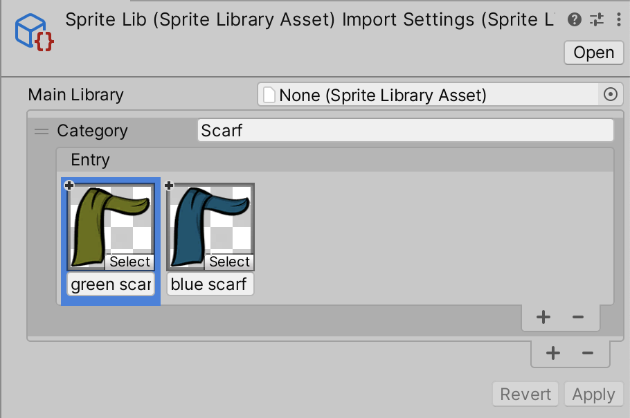
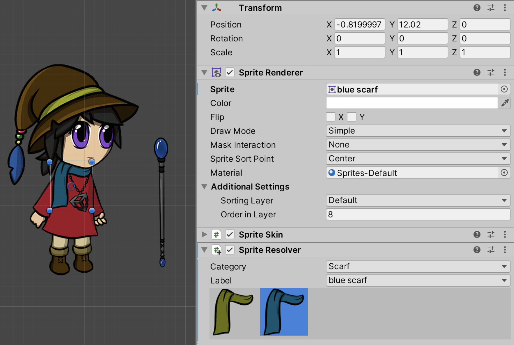
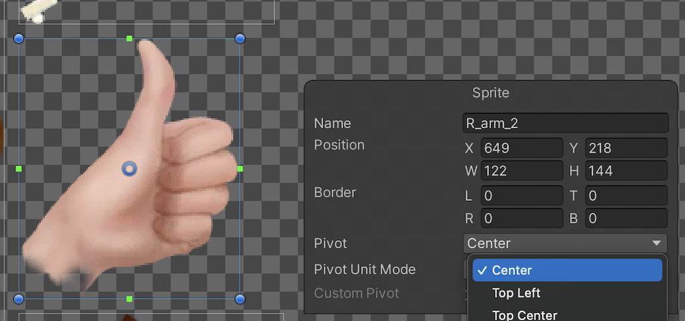
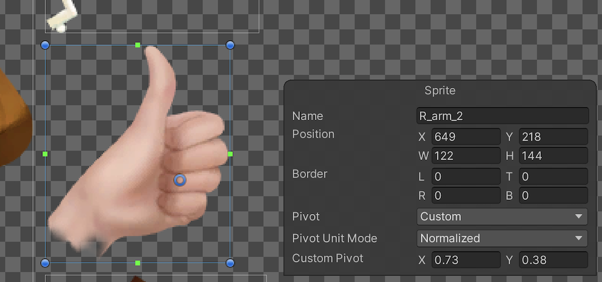
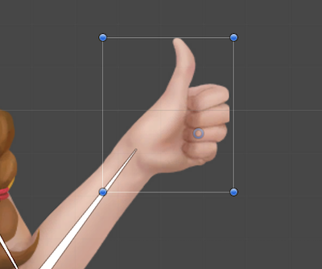

# Swapping individual Sprites
You can use __Sprite Swap__ to change only one Sprite on the actor without affecting the other Sprites. This allows you to alter part of an actor's visuals (for example, changing its clothes or skin to a different color) while keeping the rest of the visuals the same.

In the following example, there are two Sprites that are variations of the actor’s scarf, with one being green and the other being blue. This workflow demonstrates how to switch from one to the other in the same actor:

 __Left:__ The original `green scarf` Sprite. __Right:__ An alternate `blue scarf` Sprite.

1. Place the Sprites for both scarves into the same [Sprite Library Asset](SLAsset.md), and add them both to the same **Category** (named `Scarf`).
    
2. Give each of the Sprites a unique __Label__ name (in this case `green scarf` and `blue scarf` respectively). 
    
3. In the Scene, select the [Instantiated Prefab](https://docs.unity3d.com/Manual/InstantiatingPrefabs.html) and then select the `Scarf` GameObject the Hierarchy window.
    
4. Go to the [Sprite Resolver component](SLAsset.md#sprite-resolver-component) of the `Scarf` GameObject. The Sprite Resolver‘s visual selector displays the two Sprites available in the `Scarf` Category. 
    
5. Select the `blue scarf` to switch the Sprite rendered by the `Scarf` GameObject to it instead.  The Sprite Resolver's Label is set to `blue scarf`.

If you want to switch more than one Sprite at a time, consider [swapping the Sprite Library Asset](SLASwap.md) to switch to an entire alternate set of Sprites.

## Sprites pivot alignment

When working with [skinned Sprites](SkinningEditor.md), the positions of their Meshes' vertices are calculated based on the current skeleton pose, and are unaffected by each Sprite’s individual pivot. However, when [swapping](SpriteSwapIntro.md) Sprites which are not skinned (that is not [Rigged](SkinEdToolsShortcuts.md#bone-tools) to an actor’s skeleton), then they may not align correctly as their pivots are not in the same relative positions. This is especially noticeable if the Sprites are of very different sizes. The following example shows how Sprites can misalign when a skinned Sprite is swapped with an unskinned one:

|  |  |
| ----------------------- | ----------------------- |
| Figure 1: The original `open hand` Sprite. | Figure 2: Swapping to the `thumbs up` Sprite. |

In this example, the GameObject containing the Sprite and the Sprite Swap component are aligned to match the `open hand` Sprite in the Skinning Editor. As the `thumbs up` Sprite is not rigged to the same skeleton, it appears misaligned as its pivot location is not in the same relative position as the original Sprite. To align the unskinned  `thumbs up` Sprite, it is necessary to adjust it’s pivot to match the relative position of the `open hand` Sprite’s pivot.

__Note__: If a Sprite is rigged to a skeleton, then its individual pivot location is overridden by the influence and position of the bone it is weighted to .

To change the pivot position of a Sprite, first select the Sprite in the Sprite Editor, which causes the __Sprite__ panel to appear at the bottom right of the __Sprite Editor__ window. The __Sprite__ panel shows details of the selected Sprite, such as its __Name__, __Position__, and __Pivot__ properties. You can select from a dropdown list of predefined pivot options from the __Pivot__ menu. These include options such as __Center__ and __Top Left__, as well as __Custom Pivot__ (this unlocks the __Custom Pivot__ position property settings, allowing you to input your own custom position for the pivot).

In this example, the two swapped Sprites are aligned by changing the __Pivot__ property from __Center__ to __Custom Position__, and inputting the Custom Pivot position that aligns the `thumbs up` Sprite with the ``open hand`` Sprite.

After applying the changes, the swapped Sprite is now aligned with the rest of the actor after the Sprite Swap.

