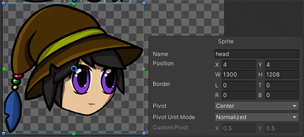
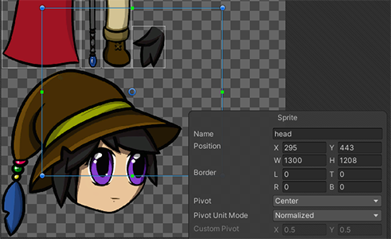
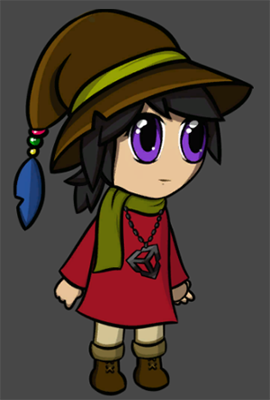
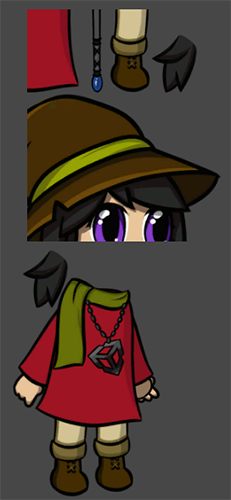
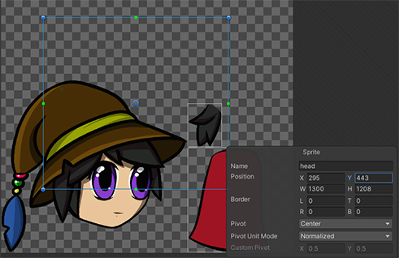
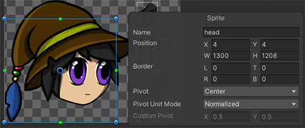

# How the PSD Importer uses SpriteRect data
The PSD Importer can store five separate sets of[ SpriteRect](https://docs.unity3d.com/Packages/com.unity.2d.sprite@1.0/api/UnityEditor.SpriteRect.html) data, with one set for each of the five combinations of Importer property settings below:
   1. When [Sprite Mode](PSD-importer-properties.html#SpriteMode) is set to **Single**.
   2. When **Sprite Mode** is set to **Multiple**.
   3. When **Sprite Mode** is set to **Multiple,** and [Individual Sprites (Mosaic)](PSD-importer-properties.html#Mosaic) is enabled.
   4. When **Sprite Mode** is set to **Multiple**, both **Individual Sprites (Mosaic)** and [Use as Rig](PSD-importer-properties.html#use-as-rig) are enabled, and there is no [Skeleton Asset](PSD-importer-properties.html#main-skeleton) assigned as the [Main Skeleton](PSD-importer-properties.html#main-skeleton).
   5. When **Sprite Mode** is set to **Multiple**, both **Individual Sprites (Mosaic)** and **Use as Rig** are enabled, and a Skeleton Asset is assigned as the **Main Skeleton**.

Each set of data is persistent, and does not affect or overwrite the data of other sets. This means you can save different SpriteRect data for different importer settings for the same source file. The SpriteRect data persists even if you modify the dimensions and position of images in the source file, as long as the original [Layer ID](https://github.com/adobe-photoshop/generator-core/wiki/Understanding-Layer-IDs-and-Layer-Indices) of the source layers remains the same.

## Modifying SpriteRect data
The SpriteRect defines the location of the Sprite on the Texture that Unity generates from the imported source file. You can modify the location and size of each SpriteRect in the Sprite Editor.

### Moving the SpriteRect

 Example 1: Original SpriteRect location of the ‘head’ Sprite on the combined Sprite sheet Texture.

  Example 2: Drag the corners of the SpriteRect to modify its dimensions and location, or enter the coordinates and dimensions in the Sprite panel.

A SpriteRect’s modified dimensions and location on the Texture is reflected for its respective Sprite in the Scene view.

|                             |                             |
| ------------------------------------------------------------ | ------------------------------------------------------------ |
| Original character prefab and its ‘head’ Sprite with unmodified SpriteRect data. | Character prefab with its ‘head’ Sprite’s SpriteRect data modified.|

### SpriteRect follows the position of its source layer
When you enable the [Individual Sprites (Mosaic)](PSD-importer-properties.html#IndiSpriteMosaic) importer setting, the PSD Importer arranges the different layers of the source file together to form a single combined Texture when it is imported. The importer generates a SpriteRect for each of these imported layers which follows the position of its associated layer wherever that layer is placed in the combined Mosaic Texture.

 Before example: The SpriteRect of the ‘head’ layer after moving its SpriteRect from its original position.

 After example: Some of the layers are hidden in the source file before it is reimported into the Editor. The reimported Texture is different from the original, but the 'head' layer's SpriteRect follows its source layer to its placement in the new Texture.

### Resizing the source file or image
Note that a SpriteRect’s size and position remains the same if you change the image or canvas size of its source layer in the source file. You must manually edit the size and position of the SpriteRect in the Sprite Editor, or select and apply the [Automatic Reslice](PSD-importer-properties.html#automatic-reslice) option to regenerate the SpriteRect completely from the source file.

 Before example: Original position and size of the SpriteRect for the generated ‘head’ Sprite from the 'head' layer.

 After example: After increasing the size of the 'head' layer, the SpriteRect's position and size remains the same.

SpriteRect data persists until you manually delete the SpriteRect, or select the **Automatic Reslice** option and apply it in the importer settings. When you do this, Unity discards all user modifications for the current set of SpriteRect data and regenerates all the SpriteRects from the current source file.

## Summary of source file modifications and their effects on SpriteRect data
| __Modification to the source file__             | __Effect on SpriteRect data__                                |
| ----------------------------------------------- | ------------------------------------------------------------ |
| __Add a new layer or enable layer visibility__ | The PSD importer automatically generates a new Sprite from the new layer, or newly visible layer, with its associated SpriteRect. |
| __Delete a layer or disable layer visibility__  | The PSD Importer deletes the associated Sprite and SpriteRect from the Project file. |
| __Rename a layer__                            | By default, the SpriteRect copies the new name of its source layer. However if you rename the SpriteRect in the Sprite Editor, then it retains its modified name and does not copy the source layer’s new name. |
| __Change a layer or canvas size__                | When a source layer's size changes, the size and position of its related SpriteRect remain the same and do not reflect the changes made to its source layer.  To make the SpriteRect reflect the changes made to its source layer, manually edit the SpriteRect’s dimensions in the Sprite Editor, or go to the PSD Importer settings and select and apply the **Automatic Reslice** option. |

## Name collision errors
A name collision error occurs when two or more layers have the same name. This can happen for the following reasons:

1. Two or more layers in the imported source file have the same name. However, Photoshop [group layers](https://helpx.adobe.com/photoshop/using/selecting-grouping-linking-layers.html#group_and_link_layers) with the same names do not cause this issue. 
2. A new layer that the PSD Importer creates in the source file has the same name as a SpriteRect you have created or modified. 
3. A layer is renamed to the same name as a SpriteRect you have modified. 
4. A previously hidden layer with the same name as an existing SpriteRect becomes visible and Unity imports it.

When a name collision occurs, one SpriteRect retains the original name while the other is appended with a running number to the others (starting with 1). Which SpriteRect retains their original name is based on the following priority:

1. A  SpriteRect you have created or modified. 
2. The first layer in the source file, starting from the bottom of the layer stack. 
3. Currently existing SpriteRects in the Project. 
