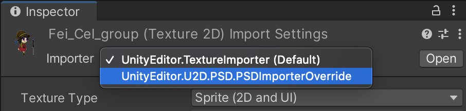

# PSD File Importer Override

It is possible to use PSDImporter to import files with 'psd' extensions. The following are the sample scripts that you can use.

## Example SetImporterOverride scripts

### PSDImporterOverride.cs
```
using UnityEngine;

namespace UnityEditor.U2D.PSD
{
    [AssetImporters.ScriptedImporter(1, new string[0],new[] {"psd"} )]
    internal class PSDImporterOverride : PSDImporter
    {
    }
}

```

### PSDImporterOverrideEditor.cs
```
namespace UnityEditor.U2D.PSD
{
    [CustomEditor(typeof(UnityEditor.U2D.PSD.PSDImporterOverride))]
    internal class PSDImporterOverrideEditor : PSDImporterEditor
    {
    }

}
```

After implementing the above scripts, you will be able to switch the importer from a dropdown list in the Inspector.

